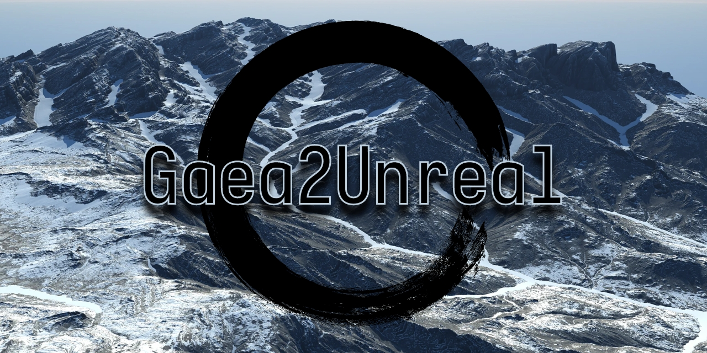
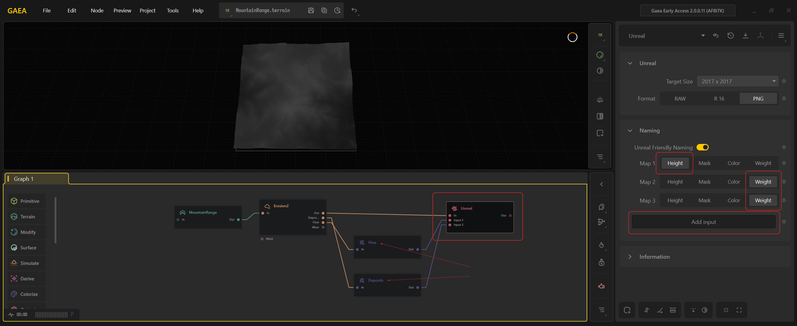
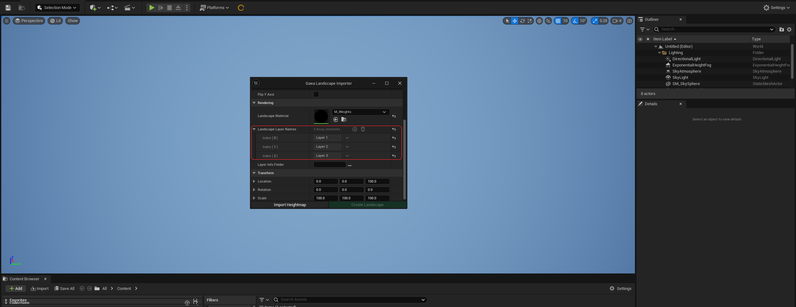

# Gaea2Unreal

Use Gaea2Unreal, specifically the Gaea Landscape Importer, to easily import a [Gaea terrain](https://quadspinner.com), color maps, weight maps, and masks in Unreal Engine 5 with a single click.

Importing terrains into Unreal Engine can be a complicated process, especially when dealing with various scales. Gaea2Unreal aims to make this an easy, seamless experience for you.

# Download 
The compiled version of the plugin can found in the [Releases](https://github.com/QuadSpinner/Gaea2Unreal/releases).

# Source Code
The source code for Gaea2Unreal can be found in this repository. The `main` branch contains the latest version. Any work-in-progress can be found in a `dev` branch while, past releases can be found in numbered version branches such as `UE-5.3`.

Issues should be opened only for the source code. For usage or other issues, you should contact [QuadSpinner Tech Support](https://quadspinner.com/support).

# Documentation and Usage Instructions
For usage instructions: https://docs.gaea.app/plugins/gaea2unreal/importing-terrains

# Website
Download Gaea Community Edition for free at https://quadspinner.com 
